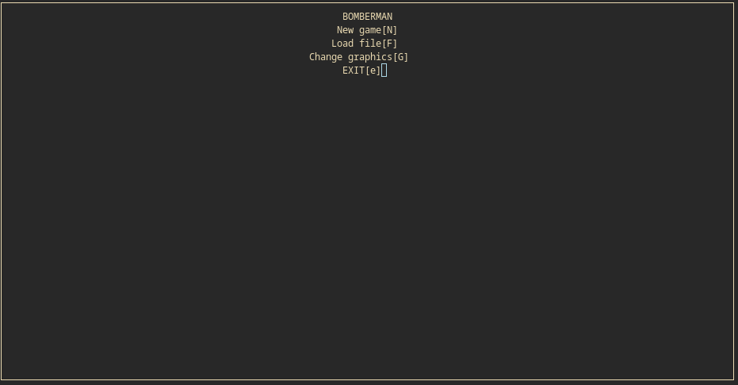
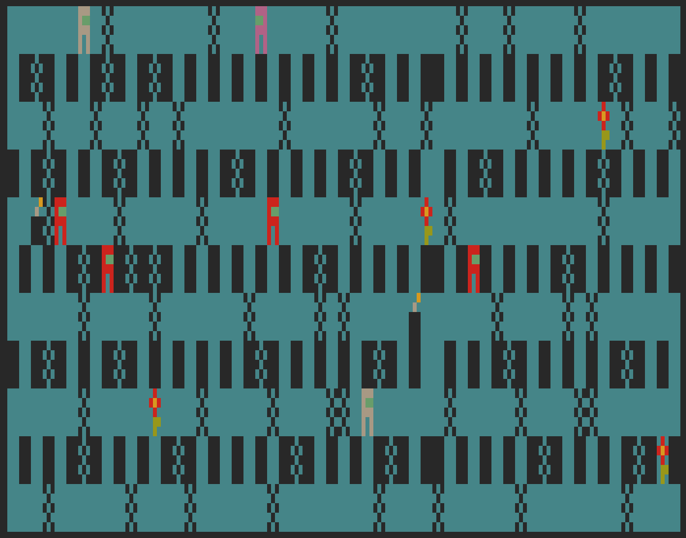
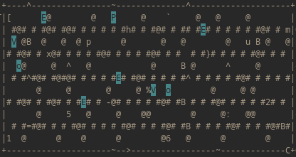
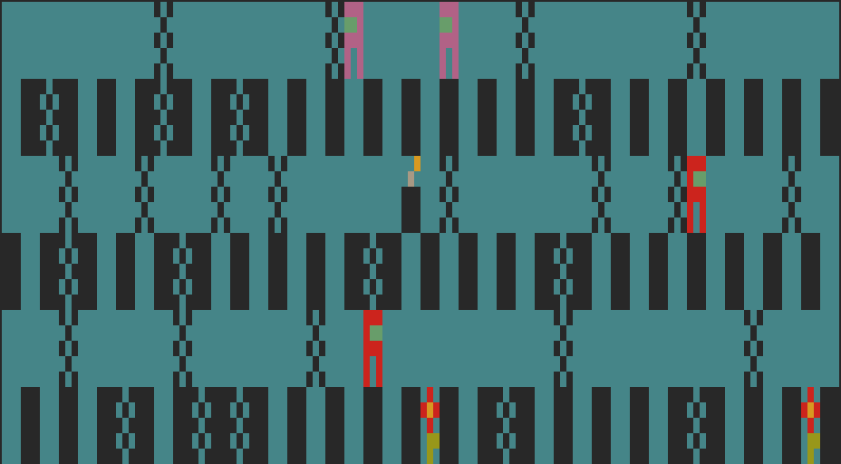

# Bomberman
Console clone of the original Bomberman game.
    https://en.wikipedia.org/wiki/Bomberman

## Instalation
```bash
$ git clone https://github.com/hajekad/Bomberman.git
$ cd Bomberman
$ make
$ ./hajekad3
```

## Playing
### Start a game by pressing (N) or select a specific level with (F).
### Pressing (G) makes the game use more complex graphics.


### Play the game with {W, A, S, D} and Place bombs with (E)


### The basic graphics are rather simple


### Play Multiplayer, Player two uses {I,J,K,L} and (O) for placing the bombs.
